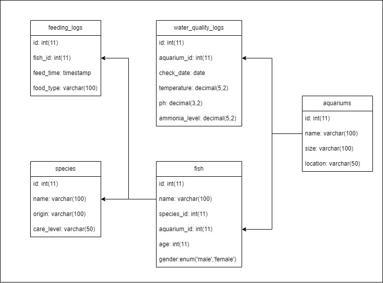

# Aquarium Management System

## Overview
Aquarium Management System adalah aplikasi berbasis web untuk mengelola dan memantau akuarium, ikan, serta data kualitas air. Sistem ini memungkinkan pengguna untuk mencatat dan melacak informasi penting tentang akuarium, spesies ikan, pemberian makan, dan parameter kualitas air.

## Entity Relationship Diagram

Berikut adalah diagram relasi entitas sistem:



*Gambar 1. Diagram ERD sistem manajemen akuarium*

**Contoh struktur ERD dalam teks:**
```sql
aquariums (id, name, size, location)
species (id, name, origin, care_level)
fish (id, species_id, aquarium_id, name, age, gender)
feeding_logs (id, fish_id, food_type, feeding_time)
water_quality_logs (id, aquarium_id, temperature, ph, ammonia, log_date)
```

## Fitur
- **Pengelolaan Akuarium**: Tambah, edit, dan hapus akuarium dengan detail lokasi dan ukuran
- **Pengelolaan Spesies**: Catatan lengkap tentang spesies ikan, asal-usul, dan tingkat perawatan
- **Pengelolaan Ikan**: Kelola data ikan individu dengan informasi spesies, akuarium, usia, dan jenis kelamin
- **Log Pemberian Makan**: Catat waktu pemberian makan dan jenis makanan untuk setiap ikan
- **Log Kualitas Air**: Pantau parameter kualitas air termasuk suhu, pH, dan level amonia
- **Pencarian dan Filter**: Cari dan filter data berdasarkan berbagai parameter
- **Tampilan Responsif**: Antarmuka yang mudah digunakan dan responsif

## Struktur Proyek
```
aquarium-management-system/
│
├── class/                  # Kelas PHP untuk logika bisnis
│   ├── Aquarium.php        # Kelas untuk mengelola data akuarium
│   ├── FeedingLog.php      # Kelas untuk mengelola log pemberian makan
│   ├── Fish.php            # Kelas untuk mengelola data ikan
│   ├── Species.php         # Kelas untuk mengelola data spesies
│   └── WaterQualityLog.php # Kelas untuk mengelola log kualitas air
│
├── config/                 # Konfigurasi aplikasi
│   └── db.php              # Konfigurasi koneksi database
│
├── database/               # File-file database
│   └── db_aquarium.sql     # Struktur dan data awal database
│
├── view/                   # Template tampilan untuk setiap halaman
│   ├── aquariums.php       # Halaman manajemen akuarium
│   ├── feeding_logs.php    # Halaman log pemberian makan
│   ├── fish.php            # Halaman manajemen ikan
│   ├── species.php         # Halaman manajemen spesies
│   └── water_quality_logs.php # Halaman log kualitas air
│
└── index.php               # File utama yang menangani routing dan inisialisasi
```

## Skema Database
Sistem ini menggunakan database MySQL dengan skema berikut:

- **aquariums**: Menyimpan informasi tentang akuarium
- **species**: Menyimpan data spesies ikan
- **fish**: Menyimpan data ikan individu yang terhubung ke spesies dan akuarium
- **feeding_logs**: Mencatat aktivitas pemberian makan ikan
- **water_quality_logs**: Mencatat pengukuran kualitas air untuk setiap akuarium

Here's the updated installation section with instructions for running the application using PHP's built-in development server:

## Instalasi

### Prasyarat
- PHP 7.4 atau lebih tinggi (dengan ekstensi PDO MySQL) - saya menggunakan PHP 8.3.15
- MySQL 5.7 atau lebih tinggi

### Langkah-langkah Instalasi
1. Clone repositori ini:
   ```bash
   git clone https://github.com/username/aquarium-management-system.git
   cd aquarium-management-system
   ```

2. Import skema database:
   ```bash
   mysql -u username -p < database/db_aquarium.sql
   ```

3. Konfigurasi koneksi database di `config/db.php`:
   ```php
   <?php
   class Database {
       private $host = "127.0.0.1"; // MacOS
       private $username = "username";
       private $password = "password";
       private $database = "db_aquarium";
       public $conn;

       public function __construct() {
           try {
               $this->conn = new PDO(
                   "mysql:host=$this->host;dbname=$this->database", 
                   $this->username, 
                   $this->password
               );
               $this->conn->setAttribute(PDO::ATTR_ERRMODE, PDO::ERRMODE_EXCEPTION);
           } catch(PDOException $e) {
               echo "Connection failed: " . $e->getMessage();
           }
       }
   }
   ?>
   ```

4. Menjalankan Aplikasi:
   Anda dapat menjalankan aplikasi menggunakan PHP built-in development server:

   ```bash
   php -S localhost:8000
   ```

5. Akses aplikasi melalui browser:
   Buka browser dan kunjungi:
   ```
   http://localhost:8000
   ```

### Catatan Penting:
- Pastikan direktori root server mengarah ke folder proyek Anda
- Server development PHP hanya untuk lingkungan pengembangan, tidak untuk produksi
- Untuk akses dari perangkat lain dalam jaringan yang sama, gunakan:
  ```bash
  php -S 0.0.0.0:8000
  ```
  Kemudian akses melalui IP komputer Anda di jaringan lokal

### Troubleshooting:
1. Jika port 8000 sudah digunakan, Anda bisa memilih port lain:
   ```bash
   php -S localhost:8001
   ```

2. Jika mendapatkan error database:
   - Pastikan MySQL server sedang berjalan
   - Verifikasi kredensial database di config/db.php
   - Pastikan ekstensi PDO MySQL diaktifkan di PHP

3. Untuk pengembangan, Anda mungkin perlu mengatur izin folder:
   ```bash
   chmod -R 755 aquarium-management-system
   ```

Dengan menggunakan PHP built-in server, Anda tidak memerlukan web server seperti Apache atau Nginx untuk pengembangan lokal, membuat proses setup menjadi lebih sederhana.

## Penggunaan

### Mengelola Akuarium
- Tambahkan akuarium baru dengan mengisi formulir di halaman akuarium
- Edit informasi akuarium yang sudah ada
- Hapus akuarium yang tidak lagi digunakan

### Mengelola Ikan dan Spesies
- Tambahkan spesies baru dengan informasi asal dan tingkat perawatan
- Tambahkan ikan baru ke akuarium dengan mengaitkannya pada spesies
- Pantau usia dan jenis kelamin ikan

### Mencatat Pemberian Makan
- Catat kapan ikan diberi makan dan jenis makanan yang diberikan
- Filter log pemberian makan berdasarkan rentang tanggal
- Cari log berdasarkan nama ikan atau jenis makanan

### Memantau Kualitas Air
- Catat pengukuran kualitas air secara teratur
- Pantau tren suhu, pH, dan level amonia
- Filter log kualitas air berdasarkan akuarium atau rentang tanggal